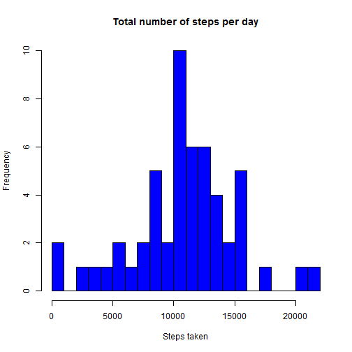
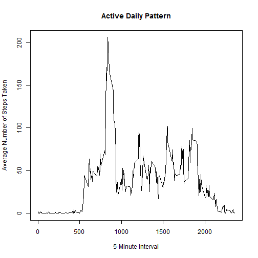
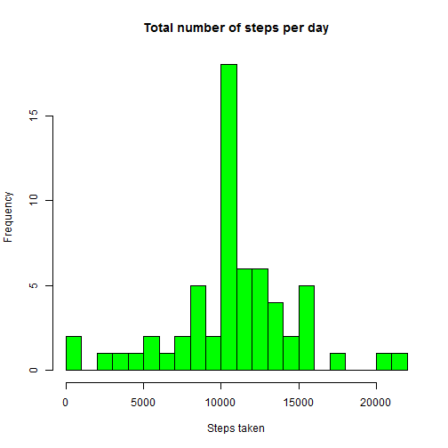
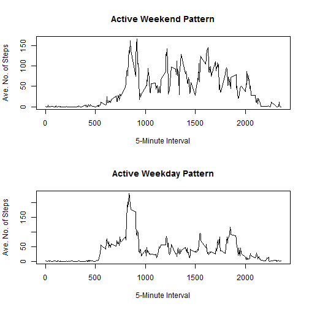

This is my analysis of the activity data for the Reproducible Research course, assignment 1.


The first task is to load the data from the CSV file. i set the working directory to a local drive.


```r
setwd("C:/David/data/repdata-035")

myDataSet <- read.csv("activity.csv")

myDataSet$date <- as.character(myDataSet$date)

head(myDataSet)
```

```
##   steps       date interval
## 1    NA 2012-10-01        0
## 2    NA 2012-10-01        5
## 3    NA 2012-10-01       10
## 4    NA 2012-10-01       15
## 5    NA 2012-10-01       20
## 6    NA 2012-10-01       25
```

First step is to show a histogram of this data to show the total number of steps taken. I will omit the NAs here, and aggregate the data on the data to be able to show the total number of steps taken in the day.


```r
myDailyData <- na.omit(myDataSet)

head(myDailyData)
```

```
##     steps       date interval
## 289     0 2012-10-02        0
## 290     0 2012-10-02        5
## 291     0 2012-10-02       10
## 292     0 2012-10-02       15
## 293     0 2012-10-02       20
## 294     0 2012-10-02       25
```

```r
myDailyData <- aggregate(myDataSet$steps, by=list(myDataSet$date), FUN=sum)

hist(myDailyData[,2], breaks=20, main="Total number of steps per day", col="blue", xlab="Steps taken")
```

 


Using the same aggregated data I will show the mean...


```r
mean(myDailyData[,2], na.rm=TRUE)
```

```
## [1] 10766.19
```

...and the median.


```r
median(myDailyData[,2], na.rm=TRUE)
```

```
## [1] 10765
```


This is the daily pattern of the steps taken during a day. The interval measurements are means.


```r
ActiveDailyPattern <- aggregate(steps ~ interval, na.omit(myDataSet), mean)

head(ActiveDailyPattern)
```

```
##   interval     steps
## 1        0 1.7169811
## 2        5 0.3396226
## 3       10 0.1320755
## 4       15 0.1509434
## 5       20 0.0754717
## 6       25 2.0943396
```

```r
plot(
        ActiveDailyPattern$interval,
        ActiveDailyPattern$steps,
        type = "l",
        main = "Active Daily Pattern",
        xlab = "5-Minute Interval",
        ylab = "Average Number of Steps Taken"
)
```

 

The 5-minute interval which, on average across all the days in the dataset, which contains the maximum number of steps is...


```r
BiggestInterval <- ActiveDailyPattern[ActiveDailyPattern$steps==max(ActiveDailyPattern$steps), ]

BiggestInterval[1,1]
```

```
## [1] 835
```


*Imputing missing values*

First of all count the number of NAs in the dataset.


```r
nas<-sum(is.na(myDataSet))

nas
```

```
## [1] 2304
```

Now we are going to fill in the NA items with the equivilant average item for the interval across the whole dataset.


```r
CompleteDataSet <- myDataSet
CompleteDataSet$steps[which(is.na(CompleteDataSet$steps))] <- tapply(CompleteDataSet$steps, CompleteDataSet$interval, mean, na.rm=TRUE, simplify=FALSE )
nas<-sum(is.na(CompleteDataSet))
nas
```

```
## [1] 0
```

Using this data i will make a histogram of the total number of steps taken each day


```r
CompleteDataSet$steps <- as.vector(CompleteDataSet$steps, mode="numeric")

CompleteDataSetAggregated <- aggregate(CompleteDataSet$steps, by=list(CompleteDataSet$date), FUN=sum)

hist(CompleteDataSetAggregated[,2], breaks=20, main="Total number of steps per day", col="green", xlab="Steps taken")
```

 

Calculate and report the mean  total number of steps taken per day. 


```r
mean(CompleteDataSetAggregated$x, na.rm = TRUE)
```

```
## [1] 10766.19
```

Calculate and report the median total number of steps taken per day. 


```r
median(CompleteDataSetAggregated$x, na.rm = TRUE)
```

```
## [1] 10766.19
```

As can be seen the mean and the median are now the same, This is the impact of imputting the NA values.

*Differences in activity patterns between weekdays and weekends*

New factor variable created in the dataset with two levels - "weekday" and "weekend" indicating whether a given date is a weekday or weekend day.


```r
CompleteDataSetDays <- CompleteDataSet
CompleteDataSetDays$day <- weekdays(as.Date(CompleteDataSet$date))
WeekDayConvert <- function(date) {
    if (weekdays(as.Date(date)) %in% c("Saturday", "Sunday")) {
        "weekend"
    } else {
        "weekday"
    }
}
CompleteDataSetDays$day <- as.factor(sapply(CompleteDataSetDays$date, WeekDayConvert))
head(CompleteDataSetDays)
```

```
##       steps       date interval     day
## 1 1.7169811 2012-10-01        0 weekday
## 2 0.3396226 2012-10-01        5 weekday
## 3 0.1320755 2012-10-01       10 weekday
## 4 0.1509434 2012-10-01       15 weekday
## 5 0.0754717 2012-10-01       20 weekday
## 6 2.0943396 2012-10-01       25 weekday
```

A panel plot created containing a time series plot of the 5-minute interval (x-axis) and the average number of steps taken, averaged across all weekday days or weekend days (y-axis).


```r
Weekends <- subset(CompleteDataSetDays, CompleteDataSetDays$day == "weekend")
Weekday <- subset(CompleteDataSetDays, CompleteDataSetDays$day == "weekday")

Weekends <- aggregate(steps ~ interval, na.omit(Weekends), mean)
Weekday <- aggregate(steps ~ interval, na.omit(Weekday), mean)


par(mfrow=c(2,1))

plot(
        Weekends$interval,
        Weekends$steps,
        type = "l",
        main = "Active Weekend Pattern",
        xlab = "5-Minute Interval",
        ylab = "Ave. No. of Steps"
)


plot(
        Weekday$interval,
        Weekday$steps,
        type = "l",
        main = "Active Weekday Pattern",
        xlab = "5-Minute Interval",
        ylab = "Ave. No. of Steps"
)
```

 


